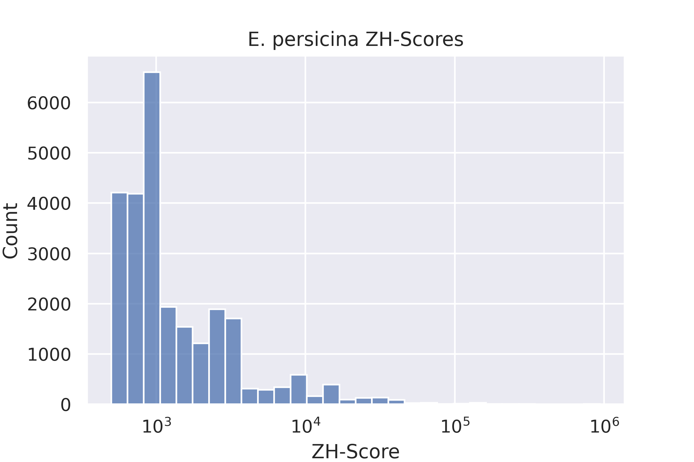
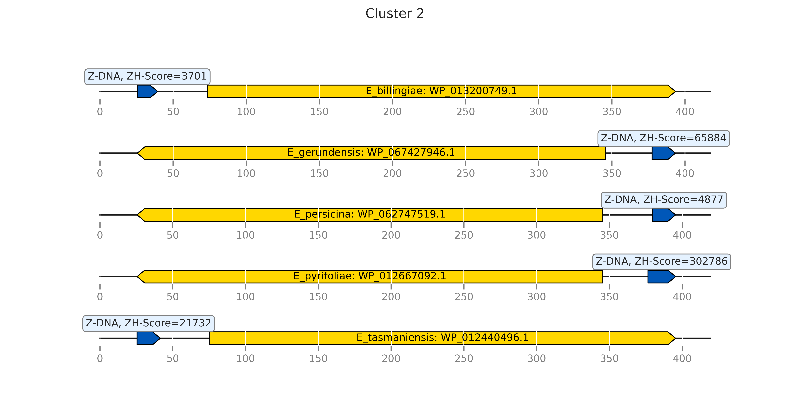
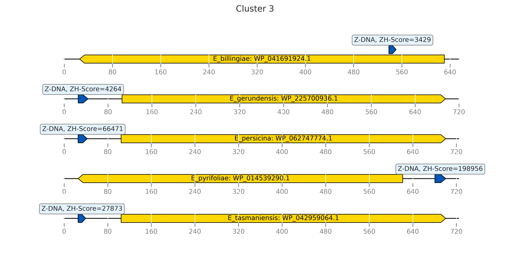
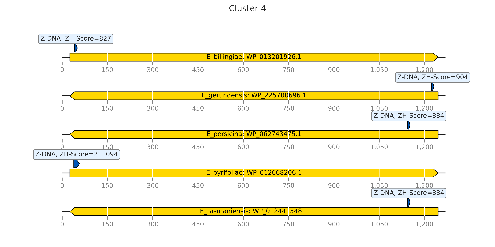
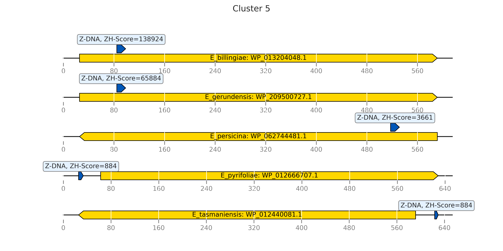
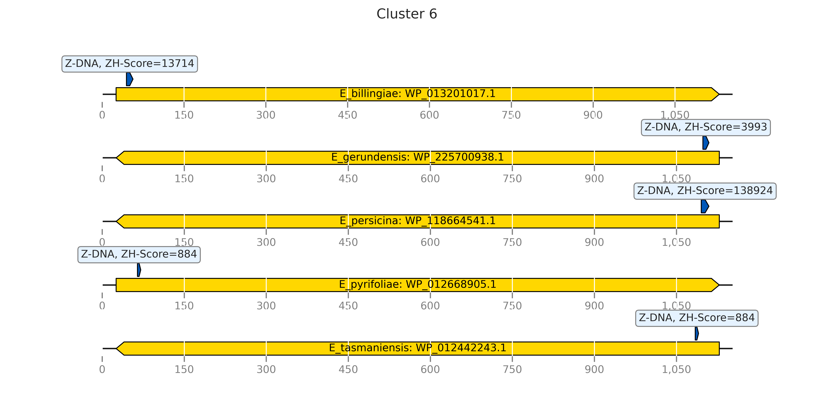

# hse22_project

## [Jupyter Notebook](notebook.ipynb)

## Сводная таблица
| Название вида | E. billingiae | E. gerundensis | E. persicina | E. pyrifoliae | E. tasmaniensis |
| :---: | :---: | :---: | :---: | :---: | :---: |
| Кол-ва последовательностей в геноме | 3 | 3 | 2 | 2 | 6 |
| Общая длина последовательностей | 5372268 | 4437416 | 4802925 | 4075681 | 4067864 |
| Длина максимальной последовательности | 5100167 | 3748909 | 4664605 | 4027225 | 3883467 |
| Количество аннотированных генов | 4703 | 3458 | 4311 | 3746 | 3569 |
| Доля аннотированных генов в геноме | 88.99 | 88.19 | 88.61 | 86.27 | 86.71 |
| Кол-во участков с ZH-Score > 500 | 29749 | 33366 | 25907 | 25346 | 26301 |
| Общая длина участков с ZH-Score > 500 | 119602 | 131756 | 107026 | 102084 | 103424 |  

## Гистограммы ZH-Score
||
|--|--|
|||
||  |

## Гомологичные кластеры

#### Найдено **4337** кластера

### 8 выбранных кластеров
Все выбранные кластеры содержат по одному гену на организм (=5 генов).

|Кластер|Функция гена|Расположение Z-DNA относительно промотора|Визуализация|
|--|--|--|--|
| 1 | tRNA guanosine(34) transglycosylase Tgt |Downstream||
| 2 | cell division protein FtsL |Upstream||
| 3 | protein deglycase YajL |Upstream/Downstream||
| 4 | cysteine desulfurase SufS |Downstream||
| 5 | 3-deoxy-manno-octulosonate-8-phosphatase KdsC |Upstream/Downstream||
| 6 | bifunctional diaminohydroxyphosphoribosylaminopyrimidine deaminase/5-amino-6-(5-phosphoribosylamino)uracil reductase RibD |Downstream||
| 7 | 50S ribosomal protein L9 |Upstream||
| 8 | GMC family oxidoreductase |Upstream||

### Белковые выравнивания
|Кластер|Выравнивание|Кластер|Выравнивание|
|--|--|--|--|
| 1 |[выравнивание](clusters/aligned/cluster_1.aln)|5|[выравнивание](clusters/aligned/cluster_5.aln)|
| 2 |[выравнивание](clusters/aligned/cluster_2.aln)|6|[выравнивание](clusters/aligned/cluster_6.aln)|
| 3 |[выравнивание](clusters/aligned/cluster_3.aln)|7|[выравнивание](clusters/aligned/cluster_7.aln)|
| 4 |[выравнивание](clusters/aligned/cluster_4.aln)|8|[выравнивание](clusters/aligned/cluster_8.aln)|

## Анализ квадруплексов
Отобрано 3 кластера

|Кластер|Функция гена|Количество геномов|Визуализация|
|--|--|--|--|
| 1 | FtsH protease activity modulator HflK |5||
| 2 | flagella biosynthesis regulator Flk |4||
| 3 | acyltransferase |4||

## Ссылки на файлы
1. [Геномы, feature table и протеомы](genomes/)
2. [Гистограммы (+ по квадруплексам)](histograms/)
3. [Вывод proteinortho](ortho/)
4. [Результаты zhunt](zhunt_result/)
5. [Результаты pqsfinder](pqs_result/)
6. [BED-файлы с TSS](TSS/)
7. [Пересечения zhunt и pqsfinder с TSS](intersect/)
8. [Сырые сиквенсы белков по кластерам](clusters/raw/)
9. [Выравнивания белков в кластерах](clusters/aligned/)

